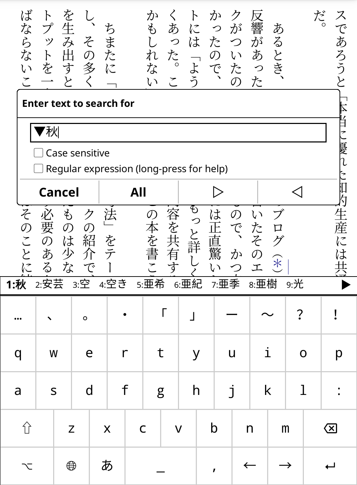

# skk.koplugin — SKK Japanese Input for KOReader

A [KOReader](https://github.com/koreader/koreader) plugin that brings
[SKK](https://ja.wikipedia.org/wiki/SKK) (Simple Kana to Kanji) style Japanese
input to every text field in KOReader.

  
   
  <em>Romaji <code>aki</code> → reading <code>あき</code> → kanji candidate <code>秋</code>, with the candidate bar offering alternatives.</em>

Works on **all KOReader platforms**:

| Platform | Input method |
|---|---|
| Kindle, Android, PocketBook (touch only) | Virtual keyboard (🌐 → 日本語 SKK) |
| SDL emulator / devices with a physical keyboard | Physical keys via SKKInputText |

---

## Features

- Romaji → hiragana → kanji conversion in SKK style
- Bundled dictionary (`SKK-JISYO.L` converted to UTF-8, ~5.9 MB) — loaded instantly via SQLite
- User dictionary: register new words, view usage history, delete entries, export
- Add extra dictionaries from settings (EUC-JP files auto-converted with iconv)
- Touch-friendly virtual keyboard with number row and Japanese punctuation
- Candidate cycling with wrap-around; direct selection by number keys (1–9)
- Hiragana / Katakana / ASCII mode switching
- In-app update check (Menu → SKK → Check for updates)
- Zero core KOReader file modifications — drop-in plugin

---

## Installation

1. Copy the `skk.koplugin/` folder into your KOReader `plugins/` directory.
2. Start KOReader.
3. For the touch virtual keyboard, open any text field and tap the **🌐** globe
   key; select **日本語 SKK** from the layout list.

The plugin is active as soon as it loads. Physical-keyboard typing in any input
field uses SKK conversion automatically; `Ctrl+\` toggles SKK on/off per field,
and `l` switches to ASCII mode within SKK. On touch devices, choosing a non-SKK
layout from the 🌐 menu falls back to plain input.

> **First run**: the bundled dictionary is converted to a SQLite database on first
> use. This takes a few seconds and shows a "変換中…" progress message. Subsequent
> starts are instant.

---

## Physical keyboard / SDL emulator

When the plugin is enabled, every `InputDialog` text field uses `SKKInputText`.
On the SDL emulator (Linux / macOS / Windows desktop build) the virtual keyboard
is automatically shown so you can see the current mode.

### Key bindings

| Key | Action |
|---|---|
| `a`–`z` | Type romaji → committed as hiragana (or katakana / ASCII) |
| `Shift`+letter | Start kanji-conversion mode ▽ |
| `Space` (in ▽) | Look up candidates → ▼ mode |
| `Space` / `n` (in ▼) | Next candidate (wraps around) |
| `p` (in ▼) | Previous candidate |
| `1`–`9` (in ▼) | Select candidate by number |
| `Enter` | Commit current composition |
| `Backspace` | Delete character / cancel conversion |
| `x` (in ▼) | Cancel candidate selection |
| `q` | Toggle hiragana ↔ katakana mode |
| `l` | Switch to ASCII pass-through mode |
| `Ctrl`+`\` | Toggle SKK on/off for this field |

---

## Virtual keyboard (touch)

The SKK keyboard has 5 rows. Row 1 adapts to the current state:

- **Normal mode** — mode indicator (あ / ア / A) + Japanese punctuation
- **SELECT mode** — number keys 1–9 for direct candidate selection

### Layer layout

| Key | Normal (no modifier) | ⇧ (Shift) | ⌥ (Symbol) | ⇧+⌥ |
|---|---|---|---|---|
| Q row | q … p | Q … P | 1 … 0 | ! ？ … 〇 |
| A row | a … : | A … : | @ … 。 | ＠ … ： |
| Z row | z … , | Z … , | - … , | ー … 、 |

### Converting to kanji

1. Tap a **shifted letter** (e.g. Shift + K) to enter ▽ mode.
2. Type the reading in romaji.
3. Tap **Space** — the first candidate appears as inline preedit:
   `▼漢字 [2:幹事 3:監事…]`
4. Continue tapping **Space** to cycle, or tap a **number key** to select directly.
5. Tap **Enter** to commit, or **✕** (or Backspace) to cancel.

If no candidates are found, a registration dialog appears so you can add the word
to your user dictionary.

---

## Dictionaries

The bundled `SKK-JISYO.utf8` is derived from
[SKK-JISYO.L](https://github.com/skk-dev/dict) (GPL-2.0+) and is automatically
kept up to date by CI (weekly sync from upstream).

### Extra dictionaries

**Menu → Tools → SKK Japanese Input → Dictionaries → Add dictionary…**

Enter the full path to a UTF-8 or EUC-JP SKK dictionary file.
EUC-JP files are auto-converted with `iconv` when available (Linux/macOS desktop;
**not** available on Kindle).

### User dictionary

Words registered during conversion are stored in a SQLite user dictionary:

**Menu → Tools → SKK Japanese Input → User dictionary**

- View all registered words with usage counts and last-used date
- Delete individual entries
- Export to `.utf8` format for backup or transfer

---

## Updating

**Menu → Tools → SKK Japanese Input → Check for updates**

Checks GitHub for a new release and downloads all plugin files (including the
updated dictionary) over WiFi. A restart prompt appears on completion.

The dictionary is also updated automatically via CI every week; users who run
"Check for updates" will always get the latest `SKK-JISYO.utf8`.

---

## Romaji conversion table (selection)

| Romaji | Kana | Romaji | Kana |
|---|---|---|---|
| a / i / u / e / o | あいうえお | ka ki ku ke ko | かきくけこ |
| sa si/shi su se so | さしすせそ | ta ti/chi tu/tsu te to | たちつてと |
| na ni nu ne no | なにぬねの | ha hi fu he ho | はひふへほ |
| ma mi mu me mo | まみむめも | ya yu yo | やゆよ |
| ra ri ru re ro | らりるれろ | wa wi we wo | わゐゑを |
| ga gi gu ge go | がぎぐげご | za zi/ji zu ze zo | ざじずぜぞ |
| da di du de do | だぢづでど | ba bi bu be bo | ばびぶべぼ |
| pa pi pu pe po | ぱぴぷぺぽ | nn / n+consonant | ん |
| z, / z. | 、。 | z[ / z] | 「」 |
| z- | 〜 | z/ | ・ |

Double a consonant before a vowel for sokuon: `kk` → っk (e.g. `kka` → っか).

---

## License

- Plugin code: GPL-2.0-or-later
- Bundled dictionary (`SKK-JISYO.utf8`): GPL-2.0-or-later (from [skk-dev/dict](https://github.com/skk-dev/dict))
